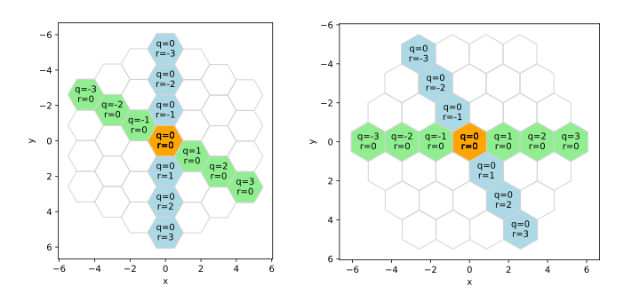
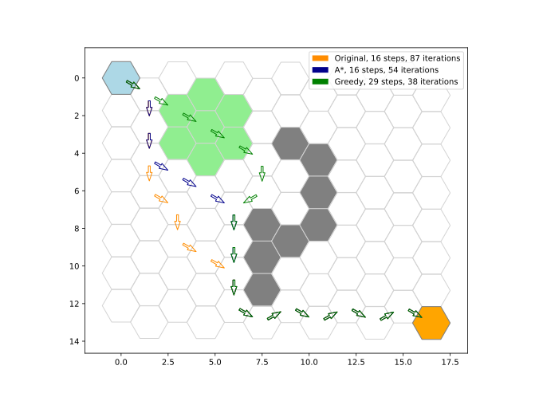

# Geks - hexagonal maps package
Geks implements basic operations in a plain hexagonal space neccessary for
creating maps of hexagonal tiles. It also allows to build paths between tiles
using some well known algorithms.

In some time Geks might be converted to a more specific map generation project.

## Coordinate system
This package uses 
[axial approach](https://www.redblobgames.com/grids/hexagons/#coordinates)
which allows to use cartesian operators with minor changes. It uses two
coordinates, _q_ and _r_. Orientation of _q_ and _r_ axes slightly differs for
flat and pointy top hexagons.

Conversions between hexagonal and screen coordinates are implemented by
methods `hex2pixel` and `pixel2hex` of a `Layout` class.

## Pathfinding
At this point Geks can calculate a path between two mapped hexagons using
[Dijkstra's algorithm](https://en.wikipedia.org/wiki/Dijkstra%27s_algorithm).
There are also two modifications of this method:
[A\*](https://en.wikipedia.org/wiki/A*_search_algorithm) and
[greedy search](https://en.wikipedia.org/wiki/Greedy_algorithm).
The original algorithm is useful for determining all possible movement options
for a given hexagon. A* method is more efficient for a targeted pathfinding.
Greedy search is usually more efficient than A* in terms of calculation time but
may return inefficient path.

On the following image green hexagons denote rugged terrain, grey tiles are
impassable walls.

User may determine cost of movement over each hexagon (e.g. travel time) and
what hexagons are blocked for trespassing (e.g. have walls on them).

## Dependencies
Geks uses following packages not included in standard library:
- numpy
- pytest (optional)
- matplotlib (optional)

## Credits
This package is mostly based on the theory from
[Red Blob Games articles](https://www.redblobgames.com/).
